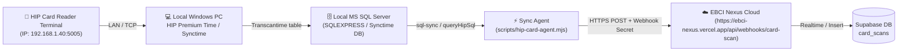

# 📋 EBCI Nexus — HIP Card Scanning & Sync Setup Guide (Codex Handoff)

> **Document Version**: 1.0 (August 2026)  
> **Target Audience**: Codex / AI Agent / IT Administrator  
> **Target OS**: Windows 10 / 11 (64-bit)  
> **Repository**: [caserebel-maker/EBCI-Nexus](https://github.com/caserebel-maker/EBCI-Nexus)

---

## 🏗️ 1. System Architecture Overview



There are two operational modes available for syncing card scans:
1. **Mode A: SQL Database Sync (`sql-sync`) [PRIMARY / RECOMMENDED]**  
   The official HIP Premium Time / Synctime desktop application pulls logs from the reader into local SQL Server Express (`Synctime` database). Our sync script queries `dbo.Transcantime` and automatically posts new scans to the Nexus Cloud Webhook.
2. **Mode B: Direct Terminal Sync (`sync` / `watch` / `probe`) [STANDALONE]**  
   Connects directly to the HIP Terminal via TCP/UDP (`node-zklib` on port 5005) without requiring SQL Server.

---

## 📦 2. Prerequisites on the New Computer

Ensure the following software packages are installed on the new Windows PC:

1. **Node.js LTS** (v18.x, v20.x, or v22.x):  
   Download from [https://nodejs.org/](https://nodejs.org/) (Ensure `Add to PATH` is checked during installation).
2. **Git for Windows**:  
   Download from [https://git-scm.com/](https://git-scm.com/).
3. **Microsoft SQL Server Express & Command Line Utilities (`sqlcmd`)** *(Required if using Mode A)*:
   - SQL Server Express (2019 / 2022) with database name `Synctime` or default HIP installation.
   - `sqlcmd` utility must be accessible in system `PATH`.
4. **HIP Desktop Software**:
   - HIP Premium Time / HIP Time 4.0 / Synctime software provided by HIP Global.

---

## ⚙️ 3. Installation & Project Setup

Open **PowerShell** or **Command Prompt** as Administrator:

### Step 3.1: Clone the Repository
```powershell
cd C:\
git clone https://github.com/caserebel-maker/EBCI-Nexus.git
cd C:\EBCI-Nexus
```

### Step 3.2: Install Dependencies
```powershell
npm install
```

### Step 3.3: Configure Environment Variables
Create a file named `.env.local` or `.env` in the root of `C:\EBCI-Nexus\` with the following settings:

```env
# ==============================================================================
# EBCI NEXUS - HIP SYNC AGENT CONFIGURATION
# ==============================================================================

# Webhook Endpoint & Secret Key
NEXUS_CARD_SCAN_WEBHOOK=https://ebci-nexus.vercel.app/api/webhooks/card-scan
CARD_SCAN_WEBHOOK_SECRET=ebci_card_webhook_secret_production_2026

# Physical HIP Terminal Details (Default IP/Port)
HIP_HOST=192.168.1.40
HIP_PORT=5005
HIP_COMM_KEY=0
HIP_DEVICE_ID=HIPCI100S
HIP_PROTOCOL=tcp

# SQL Server Configuration (For Mode A - Synctime DB)
HIP_SQL_SERVER=.\SQLEXPRESS
HIP_SQL_DATABASE=Synctime
# HIP_SQL_USER=sa
# HIP_SQL_PASSWORD=your_password
SQLCMD_PATH=sqlcmd
```

---

## 🔍 4. Verification & Testing

### Test 1: Network & Terminal Probe (Direct Mode)
Verify that the computer can reach the physical card scanner:
```powershell
# 1. Ping the reader
ping 192.168.1.40

# 2. Probe using the agent
npm run hip:probe -- --host 192.168.1.40 --port 5005
```
*Expected Output*: `[hip-agent] TCP ok`, followed by `[hip-agent] ZK/HIP protocol connected`.

### Test 2: SQL Server Database Sync (Dry Run)
Check if the local SQL Server database has new scan logs:
```powershell
node scripts/hip-card-agent.mjs sql-sync --dry-run --limit 10
```
*Expected Output*: Displays JSON records of recent scans from `dbo.Transcantime`.

### Test 3: Live Sync Test (1 Iteration)
Send real records to EBCI Nexus Cloud:
```powershell
node scripts/hip-card-agent.mjs sql-sync --once
```
*Expected Output*: `[hip-agent] webhook result: { success: true, count: ... }`.

---

## 🚀 5. Setting up 24/7 Background Automatic Sync

To ensure the sync agent runs continuously and restarts automatically on Windows boot, use one of the following methods:

### Method A: Windows Task Scheduler (Automated Setup Batch Script)
Right-click `scripts\setup-hip-agent.bat` and select **"Run as administrator"**.
* This creates a Windows Scheduled Task named `EBCI_HIP_Agent` that starts on user logon.

### Method B: PowerShell Background Loop (Recommended for Dedicated PC)
Run the built-in sync loop with lockfile handling and auto-retry:
```powershell
# Run the continuous sync loop in background (checks every 60s)
powershell.exe -NoProfile -ExecutionPolicy Bypass -File scripts\run-hip-sql-sync-loop.ps1
```

Or execute via command script:
```cmd
scripts\run-hip-sql-sync.cmd
```

---

## 🛠️ 6. Monitoring & Maintenance

### Log Files
- **SQL Sync Logs**: `C:\EBCI-Nexus\hip-sql-sync.log`
- **Loop Heartbeat Logs**: `C:\EBCI-Nexus\hip-sql-sync-loop.log`
- **Sync State Tracking**: `C:\EBCI-Nexus\.hip-card-agent-state.json` (Stores last posted `transcantime_id` and timestamp to prevent duplicate posts)

### Common Troubleshooting

| Issue | Cause | Solution |
| :--- | :--- | :--- |
| **TCP Timeout to 192.168.1.40:5005** | IP subnet mismatch or scanner disconnected | Ensure PC network adapter is on the `192.168.1.x` subnet. Verify physical LAN cable. |
| **`sqlcmd` is not recognized** | Missing SQL Server command line tools | Install `sqlcmd` / ODBC Driver 17/18 for SQL Server and restart terminal. |
| **Webhook 401 Unauthorized** | Secret mismatch | Check `CARD_SCAN_WEBHOOK_SECRET` in `.env.local` matches Vercel environment. |
| **Lockfile stuck** | Previous process crashed unexpectedly | Delete `C:\EBCI-Nexus\.hip-sql-sync.lock` and rerun. |
| **Port 5005 busy / Protocol Error** | HIP desktop app is holding active socket in Direct Mode | Close the official HIP desktop app when running direct probe / sync mode. |

---

## 📞 7. Quick Commands Reference

```powershell
# Probe HIP device connection
npm run hip:probe

# Sync via SQL Server (dry run)
npm run hip:sql-sync -- --dry-run

# Run full SQL sync once
npm run hip:sql-sync -- --once

# View recent log output
Get-Content -Tail 50 -Wait hip-sql-sync.log
```
